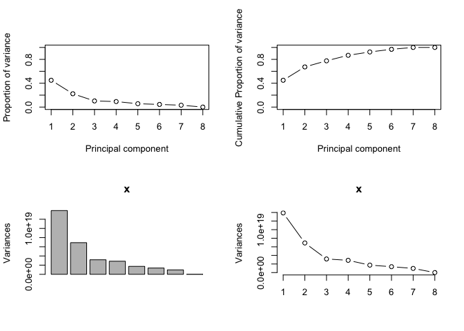
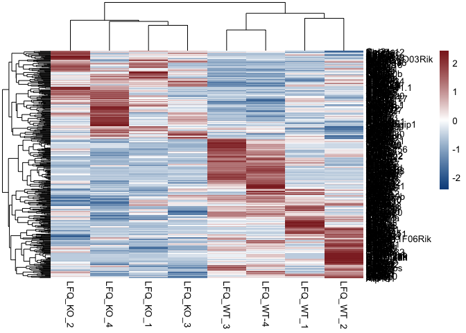
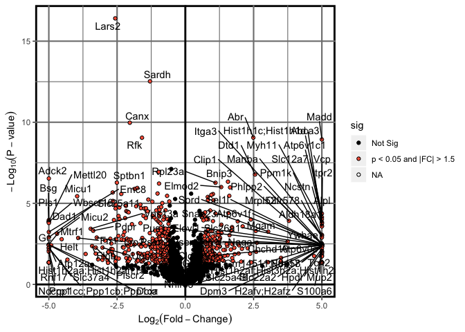

# Proteomics Data Visualization
## Heatmap


```r
library(dplyr)
library(tidyr)
library(pheatmap)
library(openxlsx)
##Pull data for analysis
Kidney_raw<-read.xlsx("../1_Input/2_Protein/Kidney - PN-0064-3 Ergebnisse - mep.xlsx", colNames = T, rowNames = F, sheet = "Cleaned_NoMVs")
Kidney_raw$Gene.Symbol<-make.unique(Kidney_raw$Gene.Symbol, sep = ".")
Kidney_raw.cleaned<-Kidney_raw %>% mutate(Gene.Symbol = strsplit(as.character(Gene.Symbol), split = ";")) %>% unnest(Gene.Symbol)
Kidney_raw.complete.cleaned<-Kidney_raw.cleaned[!is.na(Kidney_raw.cleaned$Gene.Symbol),]
Kidney_raw.complete.cleaned$Gene.Symbol<-make.unique(Kidney_raw.complete.cleaned$Gene.Symbol, sep = ".")
LFQs.Kidney_raw<-dplyr::select(Kidney_raw.complete.cleaned, contains("LFQ"))
rownames(LFQs.Kidney_raw)<-Kidney_raw.complete.cleaned$Gene.Symbol
```

## Principal Components Analysis

Once we established that the populations under consideration truly display divergene expression patterns, we sought to determine whether unbiased global gene expression patterns recapitulate the described phenotypes within each Kidney failure group. To accomplish this, an unsupervised Principal Components Analysis (PCA) was initially used with normalized counts.

### PCA Features

Before running the principal components analysis, it was necessary to first determine the number of PC's required to account for 80% of the variance, a machine-learning algorithmm benchmark that provides sufficient confidence in the analysis.


```r
#Plot Features of the PCA
library(readxl)
library(dplyr)
library(plotly)
#transpose the dataset (required for PCA)
data.pca<-t(LFQs.Kidney_raw)
data.pca<-as.data.frame(data.pca)
##Import the data to be used for annotation
Index<-c(0,0,0,0,1,1,1,1)
Index<-as.data.frame(Index)
##merge the file
data.pca_Final<-cbind(Index, data.pca)
rownames(data.pca_Final)<-data.pca_Final$Row.names
pca.comp<-prcomp(data.pca_Final[,(ncol(Index)+2):ncol(data.pca_Final)])

pcaCharts=function(x) {
    x.var <- x$sdev ^ 2
    x.pvar <- x.var/sum(x.var)
    par(mfrow=c(2,2))
    plot(x.pvar,xlab="Principal component", 
         ylab="Proportion of variance", ylim=c(0,1), type='b')
    plot(cumsum(x.pvar),xlab="Principal component", 
         ylab="Cumulative Proportion of variance", 
         ylim=c(0,1), 
         type='b')
    screeplot(x)
    screeplot(x,type="l")
    par(mfrow=c(1,1))
}
pcaCharts(pca.comp)
```

<!-- -->

```r
png(file=paste0("../2_Output/2_Protein/Proteomics.Kidney_PCA.Charts.png"))
pcaCharts(pca.comp)
dev.off()
```

```
## quartz_off_screen 
##                 2
```

### 3-Dimensional PCA

From the previous calculations, it is appears that 3 principal components are necessary (accounting for >80% cumulative variance).


```r
##Create a 3D-PCA for Inspection
library(plotly)
##Index
PCs<-cbind(pca.comp$x, Index)
rownames(PCs)<-rownames(data.pca)
ax_text<-list(
  family = "times",
  size = 12,
  color = "black")
t <- list(
  family = "times",
  size = 14,
  color = "black")
p <- plot_ly(PCs, x = ~PC1, y = ~PC2, z = ~PC3,
   marker = list(color = ~Index, 
                 colorscale = c('#FFE1A1', '#683531'), 
                 showscale = TRUE),
  text=rownames(PCs)) %>%
  add_markers() %>% 
  layout(scene = list(
     xaxis = list(title = 'PC1', zerolinewidth = 4, 
        zerolinecolor="darkgrey", linecolor="darkgrey", 
        linewidth=4, titlefont=t, tickfont=ax_text),
     yaxis = list(title = 'PC2', zerolinewidth = 4, 
        zerolinecolor="darkgrey", linecolor="darkgrey", 
        linewidth=4, titlefont=t, tickfont=ax_text),
    zaxis = list(title = 'PC3', zerolinewidth = 4, 
        zerolinecolor="darkgrey",  linecolor="darkgrey", 
        linewidth=4, titlefont=t, tickfont=ax_text)),
  annotations = list(
           x = 1.13,
           y = 1.03,
           text = 'Diabetes',
           xref = '1',
           yref = '0',
           showarrow = FALSE))
p #must comment out for PDF generation via knitr (Pandoc)
```

<!--html_preserve--><div id="htmlwidget-c4b17b04e1a6ae453b16" style="width:672px;height:480px;" class="plotly html-widget"></div>
<script type="application/json" data-for="htmlwidget-c4b17b04e1a6ae453b16">{"x":{"visdat":{"8ae76600c5c4":["function () ","plotlyVisDat"]},"cur_data":"8ae76600c5c4","attrs":{"8ae76600c5c4":{"x":{},"y":{},"z":{},"marker":{"color":{},"colorscale":["#FFE1A1","#683531"],"showscale":true},"text":["LFQ_KO_1","LFQ_KO_2","LFQ_KO_3","LFQ_KO_4","LFQ_WT_1","LFQ_WT_2","LFQ_WT_3","LFQ_WT-4"],"alpha_stroke":1,"sizes":[10,100],"spans":[1,20],"type":"scatter3d","mode":"markers","inherit":true}},"layout":{"margin":{"b":40,"l":60,"t":25,"r":10},"scene":{"xaxis":{"title":"PC1","zerolinewidth":4,"zerolinecolor":"darkgrey","linecolor":"darkgrey","linewidth":4,"titlefont":{"family":"times","size":14,"color":"black"},"tickfont":{"family":"times","size":12,"color":"black"}},"yaxis":{"title":"PC2","zerolinewidth":4,"zerolinecolor":"darkgrey","linecolor":"darkgrey","linewidth":4,"titlefont":{"family":"times","size":14,"color":"black"},"tickfont":{"family":"times","size":12,"color":"black"}},"zaxis":{"title":"PC3","zerolinewidth":4,"zerolinecolor":"darkgrey","linecolor":"darkgrey","linewidth":4,"titlefont":{"family":"times","size":14,"color":"black"},"tickfont":{"family":"times","size":12,"color":"black"}}},"annotations":[{"x":1.13,"y":1.03,"text":"Diabetes","xref":"1","yref":"0","showarrow":false}],"hovermode":"closest","showlegend":false},"source":"A","config":{"showSendToCloud":false},"data":[{"x":[-4059325464.53384,437610038.592151,5165052242.53596,2452674666.9755,-22109113.9202617,-6546222009.56621,2216439693.53922,355879946.377486],"y":[-836298574.691009,-2002258050.43762,-1116028424.73932,-2747227256.86452,-1305891988.34028,-69622725.9800378,3560543167.11013,4516783853.94268],"z":[-2175987486.81854,-2821081197.55684,1261595030.39437,593226175.417428,1577958268.78271,2176827802.02222,-573390609.823625,-39147982.4177264],"marker":{"color":[0,0,0,0,1,1,1,1],"colorscale":["#FFE1A1","#683531"],"showscale":true,"line":{"color":"rgba(31,119,180,1)"}},"text":["LFQ_KO_1","LFQ_KO_2","LFQ_KO_3","LFQ_KO_4","LFQ_WT_1","LFQ_WT_2","LFQ_WT_3","LFQ_WT-4"],"type":"scatter3d","mode":"markers","error_y":{"color":"rgba(31,119,180,1)"},"error_x":{"color":"rgba(31,119,180,1)"},"line":{"color":"rgba(31,119,180,1)"},"frame":null}],"highlight":{"on":"plotly_click","persistent":false,"dynamic":false,"selectize":false,"opacityDim":0.2,"selected":{"opacity":1},"debounce":0},"shinyEvents":["plotly_hover","plotly_click","plotly_selected","plotly_relayout","plotly_brushed","plotly_brushing","plotly_clickannotation","plotly_doubleclick","plotly_deselect","plotly_afterplot"],"base_url":"https://plot.ly"},"evals":[],"jsHooks":[]}</script><!--/html_preserve-->


```r
library(pheatmap)
library(dplyr)

Results_HM<-dplyr::filter(Kidney_raw.complete.cleaned, minuslog_pval>2)
HM_data.p05<-data.matrix(dplyr::select(Results_HM, contains("LFQ")))
rownames(HM_data.p05)<-Results_HM$Gene.Symbol
#Import the Index File
paletteLength <- 100
myColor <- colorRampPalette(c("dodgerblue4", "white", "brown4"))(paletteLength)
pheatmap(HM_data.p05, color = myColor, scale = "row")
```



```r
pheatmap(HM_data.p05, color = myColor, scale = "row", filename = "../2_Output/2_Protein/Heatmap.Kidney_LFQs.p01.pdf")
```

##Volcano Plot


```r
# Load packages
library(dplyr)
library(ggplot2)
library(ggrepel)
# Read data from the web
results<-read.xlsx("../1_Input/2_Protein/Kidney - PN-0064-3 Ergebnisse - mep.xlsx", sheet = "IPA_Import")
results = mutate(results, sig=ifelse(results$minuslogpval>1.3 & abs(results$log2FC)>0.585, "p < 0.05 and |FC| > 1.5", "Not Sig"))
results<-dplyr::arrange(results, desc(sig), desc(abs(log2FC)))
LABEL=results$Gene[1:20]
#plot the ggplot
p = ggplot(results, aes(log2FC, minuslogpval)) + theme(panel.background = element_rect("white", colour = "black", size=2), panel.grid.major = element_line(colour = "gray50", size=.75), panel.grid.minor = element_line(colour = "gray50", size=0.4)) + 
geom_point(aes(fill=sig), colour="black", shape=21) + labs(x=expression(Log[2](Fold-Change)), y=expression(-Log[10](P-value))) + xlim(-5,5)+ geom_hline(yintercept = 0, size = 1) + geom_vline(xintercept=0, size=1)+ 
scale_fill_manual(values=c("black", "tomato"))
#add a repelling effect to the text labels.
p+geom_text_repel(data=filter(results, minuslogpval>6 & abs(log2FC) > 1 | abs(log2FC) > 3 & minuslogpval>2), aes(label=Gene))
```

<!-- -->

```r
pdf(file = "../2_Output/2_Protein/Volcano.Plot_Kidney.pdf", width = 5.3, height = 4.5)
p+geom_text_repel(data=filter(results, minuslogpval>7.5 | abs(log2FC) > 3 & minuslogpval>3), aes(label=Gene))
dev.off()
```

```
## quartz_off_screen 
##                 2
```

##Weighted Gene Co-expression Network Analysis (WGCNA)


