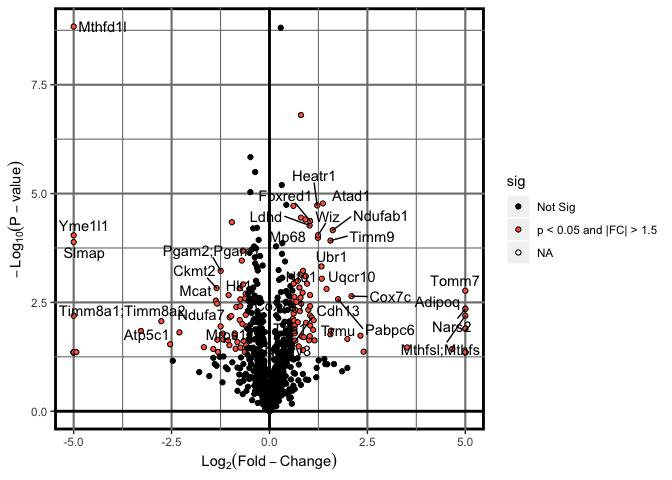
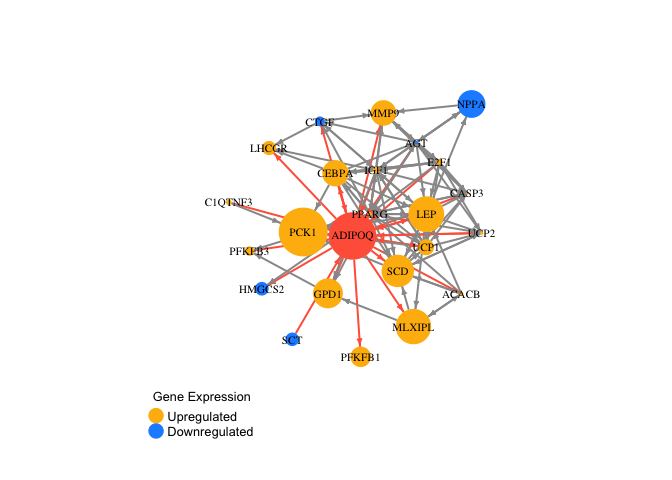
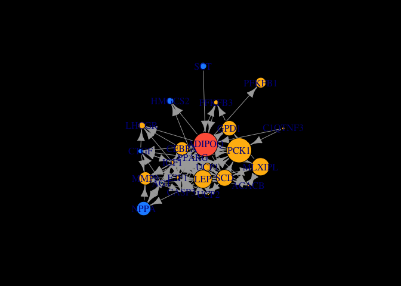
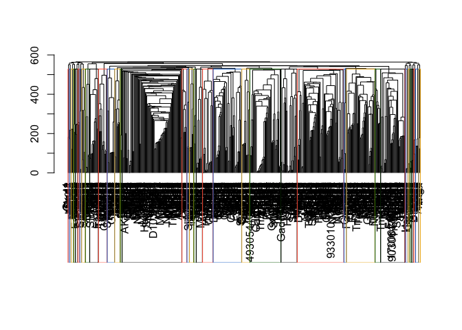
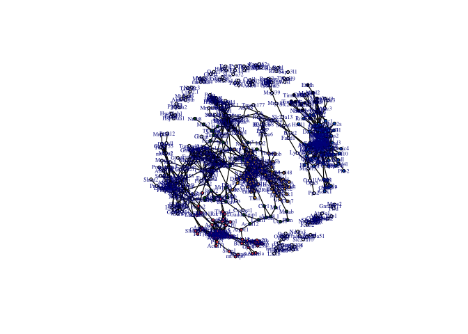
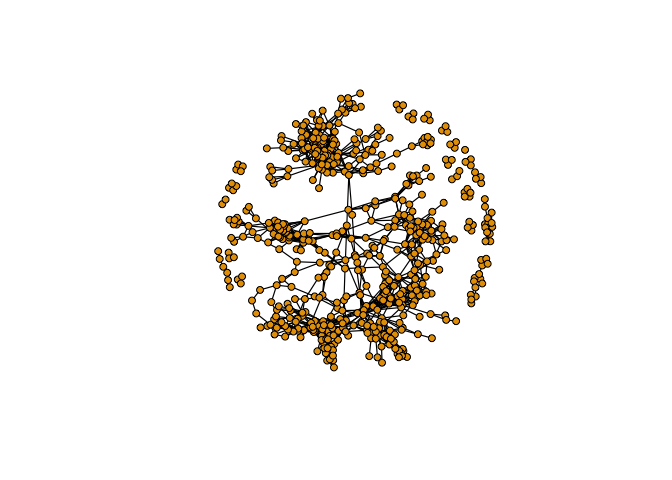
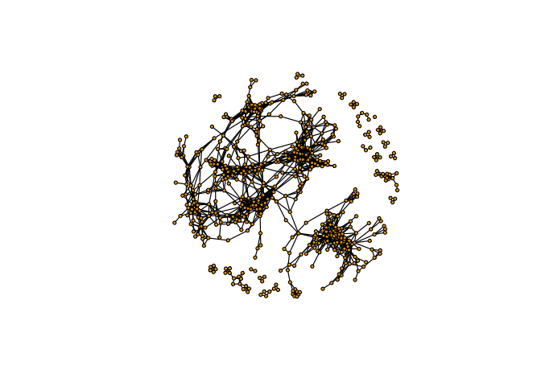

# Proteomics Data Visualization
##Heatmap


```r
library(dplyr)
library(tidyr)
library(pheatmap)
library(openxlsx)
##Pull data for analysis
Heart_raw<-read.xlsx("../1_Input/2_Protein/Heart - PN-0064 Heart - mep.xlsx", colNames = T, rowNames = F, sheet = "Cleaned_NoMVs")
Heart_raw.cleaned<-Heart_raw %>% mutate(Gene.Symbol = strsplit(as.character(Gene.Symbol), split = ";")) %>% unnest(Gene.Symbol)
Heart_raw$Gene.Symbol<-make.unique(Heart_raw$Gene.Symbol, sep = ".")
Heart_raw.complete.cleaned<-Heart_raw.cleaned[!is.na(Heart_raw.cleaned$Gene.Symbol),]
LFQs.Heart_raw<-dplyr::select(Heart_raw.complete.cleaned, contains("LFQ"))
rownames(LFQs.Heart_raw)<-make.unique(Heart_raw.complete.cleaned$Gene.Symbol, sep = ".")
```

## Principal Components Analysis

Once we established that the populations under consideration truly display divergene expression patterns, we sought to determine whether unbiased global gene expression patterns recapitulate the described phenotypes within each heart failure group. To accomplish this, an unsupervised Principal Components Analysis (PCA) was initially used with normalized counts.

### PCA Features

Before running the principal components analysis, it was necessary to first determine the number of PC's required to account for 80% of the variance, a machine-learning algorithmm benchmark that provides sufficient confidence in the analysis.


```r
#Plot Features of the PCA
library(dplyr)
library(plotly)
#transpose the dataset (required for PCA)
data.pca<-t(LFQs.Heart_raw[rowSums(LFQs.Heart_raw)>1,])
data.pca<-as.data.frame(data.pca)
##Import the data to be used for annotation
Index<-c(0,0,0,0,1,1,1,1)
Index<-as.data.frame(Index)
##merge the file
data.pca_Final<-cbind(Index, data.pca)
rownames(data.pca_Final)<-data.pca_Final$Row.names
pca.comp<-prcomp(data.pca_Final[,(ncol(Index)+2):ncol(data.pca_Final)])

pcaCharts=function(x) {
    x.var <- x$sdev ^ 2
    x.pvar <- x.var/sum(x.var)
    par(mfrow=c(2,2))
    plot(x.pvar,xlab="Principal component", 
         ylab="Proportion of variance", ylim=c(0,1), type='b')
    plot(cumsum(x.pvar),xlab="Principal component", 
         ylab="Cumulative Proportion of variance", 
         ylim=c(0,1), 
         type='b')
    screeplot(x)
    screeplot(x,type="l")
    par(mfrow=c(1,1))
}
pcaCharts(pca.comp)
```

<!-- -->

```r
png(file=paste0("../2_Output/2_Protein/Proteomics_PCA.Charts.png"))
pcaCharts(pca.comp)
dev.off()
```

```
## quartz_off_screen 
##                 2
```

### 3-Dimensional PCA

From the previous calculations, it is appears that 3 principal components are necessary (accounting for >80% cumulative variance).


```r
##Create a 3D-PCA for Inspection
library(plotly)
##Index
PCs<-cbind(pca.comp$x, Index)
rownames(PCs)<-rownames(data.pca)
ax_text<-list(
  family = "times",
  size = 12,
  color = "black")
t <- list(
  family = "times",
  size = 14,
  color = "black")
p <- plot_ly(PCs, x = ~PC1, y = ~PC2, z = ~PC3,
   marker = list(color = ~Index, 
                 colorscale = c('#FFE1A1', '#683531'), 
                 showscale = TRUE),
  text=rownames(PCs)) %>%
  add_markers() %>% 
  layout(scene = list(
     xaxis = list(title = 'PC1', zerolinewidth = 4, 
        zerolinecolor="darkgrey", linecolor="darkgrey", 
        linewidth=4, titlefont=t, tickfont=ax_text),
     yaxis = list(title = 'PC2', zerolinewidth = 4, 
        zerolinecolor="darkgrey", linecolor="darkgrey", 
        linewidth=4, titlefont=t, tickfont=ax_text),
    zaxis = list(title = 'PC3', zerolinewidth = 4, 
        zerolinecolor="darkgrey",  linecolor="darkgrey", 
        linewidth=4, titlefont=t, tickfont=ax_text)),
  annotations = list(
           x = 1.13,
           y = 1.03,
           text = 'Diabetes',
           xref = '1',
           yref = '0',
           showarrow = FALSE))
p #must comment out for PDF generation via knitr (Pandoc)
```

<!--html_preserve--><div id="htmlwidget-46302964ebc61924717e" style="width:672px;height:480px;" class="plotly html-widget"></div>
<script type="application/json" data-for="htmlwidget-46302964ebc61924717e">{"x":{"visdat":{"dc5f15597a80":["function () ","plotlyVisDat"]},"cur_data":"dc5f15597a80","attrs":{"dc5f15597a80":{"x":{},"y":{},"z":{},"marker":{"color":{},"colorscale":["#FFE1A1","#683531"],"showscale":true},"text":["LFQ_KO_1","LFQ_KO_2","LFQ_KO_3","LFQ_KO_4","LFQ_WT_1","LFQ_WT_2","LFQ_WT_3","LFQ_WT-4"],"alpha_stroke":1,"sizes":[10,100],"spans":[1,20],"type":"scatter3d","mode":"markers","inherit":true}},"layout":{"margin":{"b":40,"l":60,"t":25,"r":10},"scene":{"xaxis":{"title":"PC1","zerolinewidth":4,"zerolinecolor":"darkgrey","linecolor":"darkgrey","linewidth":4,"titlefont":{"family":"times","size":14,"color":"black"},"tickfont":{"family":"times","size":12,"color":"black"}},"yaxis":{"title":"PC2","zerolinewidth":4,"zerolinecolor":"darkgrey","linecolor":"darkgrey","linewidth":4,"titlefont":{"family":"times","size":14,"color":"black"},"tickfont":{"family":"times","size":12,"color":"black"}},"zaxis":{"title":"PC3","zerolinewidth":4,"zerolinecolor":"darkgrey","linecolor":"darkgrey","linewidth":4,"titlefont":{"family":"times","size":14,"color":"black"},"tickfont":{"family":"times","size":12,"color":"black"}}},"annotations":[{"x":1.13,"y":1.03,"text":"Diabetes","xref":"1","yref":"0","showarrow":false}],"hovermode":"closest","showlegend":false},"source":"A","config":{"modeBarButtonsToAdd":[{"name":"Collaborate","icon":{"width":1000,"ascent":500,"descent":-50,"path":"M487 375c7-10 9-23 5-36l-79-259c-3-12-11-23-22-31-11-8-22-12-35-12l-263 0c-15 0-29 5-43 15-13 10-23 23-28 37-5 13-5 25-1 37 0 0 0 3 1 7 1 5 1 8 1 11 0 2 0 4-1 6 0 3-1 5-1 6 1 2 2 4 3 6 1 2 2 4 4 6 2 3 4 5 5 7 5 7 9 16 13 26 4 10 7 19 9 26 0 2 0 5 0 9-1 4-1 6 0 8 0 2 2 5 4 8 3 3 5 5 5 7 4 6 8 15 12 26 4 11 7 19 7 26 1 1 0 4 0 9-1 4-1 7 0 8 1 2 3 5 6 8 4 4 6 6 6 7 4 5 8 13 13 24 4 11 7 20 7 28 1 1 0 4 0 7-1 3-1 6-1 7 0 2 1 4 3 6 1 1 3 4 5 6 2 3 3 5 5 6 1 2 3 5 4 9 2 3 3 7 5 10 1 3 2 6 4 10 2 4 4 7 6 9 2 3 4 5 7 7 3 2 7 3 11 3 3 0 8 0 13-1l0-1c7 2 12 2 14 2l218 0c14 0 25-5 32-16 8-10 10-23 6-37l-79-259c-7-22-13-37-20-43-7-7-19-10-37-10l-248 0c-5 0-9-2-11-5-2-3-2-7 0-12 4-13 18-20 41-20l264 0c5 0 10 2 16 5 5 3 8 6 10 11l85 282c2 5 2 10 2 17 7-3 13-7 17-13z m-304 0c-1-3-1-5 0-7 1-1 3-2 6-2l174 0c2 0 4 1 7 2 2 2 4 4 5 7l6 18c0 3 0 5-1 7-1 1-3 2-6 2l-173 0c-3 0-5-1-8-2-2-2-4-4-4-7z m-24-73c-1-3-1-5 0-7 2-2 3-2 6-2l174 0c2 0 5 0 7 2 3 2 4 4 5 7l6 18c1 2 0 5-1 6-1 2-3 3-5 3l-174 0c-3 0-5-1-7-3-3-1-4-4-5-6z"},"click":"function(gd) { \n        // is this being viewed in RStudio?\n        if (location.search == '?viewer_pane=1') {\n          alert('To learn about plotly for collaboration, visit:\\n https://cpsievert.github.io/plotly_book/plot-ly-for-collaboration.html');\n        } else {\n          window.open('https://cpsievert.github.io/plotly_book/plot-ly-for-collaboration.html', '_blank');\n        }\n      }"}],"cloud":false},"data":[{"x":[-2918576935.90386,2459685560.459,-1373228203.84966,-4384935680.9752,-2782814640.60711,8782857204.63625,-1329142806.06741,1546155502.30801],"y":[-2229783552.5757,-1313517517.36625,6688086733.88126,924803394.464327,822877878.794717,1210636540.40344,-3845143196.31129,-2257960281.2905],"z":[2318990539.07658,1883372339.33188,3514699646.77686,-4756014314.36773,-2624597275.7748,-2565822271.70391,733195398.188142,1496175938.47299],"marker":{"color":[0,0,0,0,1,1,1,1],"colorscale":["#FFE1A1","#683531"],"showscale":true,"line":{"color":"rgba(31,119,180,1)"}},"text":["LFQ_KO_1","LFQ_KO_2","LFQ_KO_3","LFQ_KO_4","LFQ_WT_1","LFQ_WT_2","LFQ_WT_3","LFQ_WT-4"],"type":"scatter3d","mode":"markers","error_y":{"color":"rgba(31,119,180,1)"},"error_x":{"color":"rgba(31,119,180,1)"},"line":{"color":"rgba(31,119,180,1)"},"frame":null}],"highlight":{"on":"plotly_click","persistent":false,"dynamic":false,"selectize":false,"opacityDim":0.2,"selected":{"opacity":1},"debounce":0},"base_url":"https://plot.ly"},"evals":["config.modeBarButtonsToAdd.0.click"],"jsHooks":[]}</script><!--/html_preserve-->


```r
library(pheatmap)
library(dplyr)
##Import Data Matrix
Results_HM<-dplyr::filter(Heart_raw.complete.cleaned, minuslog_pval>2)
HM_data.p05<-data.matrix(dplyr::select(Results_HM, contains("LFQ")))
rownames(HM_data.p05)<-Results_HM$Gene.Symbol
#Import the Index File
paletteLength <- 100
myColor <- colorRampPalette(c("dodgerblue4", "white", "brown4"))(paletteLength)
pheatmap(HM_data.p05, color = myColor, scale = "row")
```


```r
pheatmap(HM_data.p05, color = myColor, scale = "row", filename = "../2_Output/2_Protein/Heatmap.Heart_LFQs.p01.pdf")
```

##Volcano Plot


```r
# Load packages
library(dplyr)
library(ggplot2)
library(ggrepel)
library(openxlsx)
# Read data from the web
results<-read.xlsx("../1_Input/2_Protein/Heart - PN-0064 Heart - mep.xlsx", sheet = "IPA_Import")
results = mutate(results, sig=ifelse(results$minuslogpvalue>1.3 & abs(results$log2FC)>0.585, "p < 0.05 and |FC| > 1.5", "Not Sig"))
#plot the ggplot
p = ggplot(results, aes(log2FC, minuslogpvalue)) + theme(panel.background = element_rect("white", colour = "black", size=2), panel.grid.major = element_line(colour = "gray50", size=.75), panel.grid.minor = element_line(colour = "gray50", size=0.4)) + 
geom_point(aes(fill=sig), colour="black", shape=21) + labs(x=expression(Log[2](Fold-Change)), y=expression(-Log[10](P-value))) + xlim(-5,5)+ geom_hline(yintercept = 0, size = 1) + geom_vline(xintercept=0, size=1)+ 
scale_fill_manual(values=c("black", "tomato"))
#add a repelling effect to the text labels.
p+geom_text_repel(data=filter(results, minuslogpvalue>2 & abs(log2FC)>2), aes(label=Gene))
```

<!-- -->

```r
pdf(file = "../2_Output/2_Protein/Volcano.Plot_Heart.pdf")
p+geom_text_repel(data=filter(results, minuslogpvalue>2 & abs(log2FC)>1), aes(label=Gene))
dev.off()
```

```
## quartz_off_screen 
##                 2
```

#Network Analysis

##Load the network data


```r
# Load the packages used for the network analysis
library("igraph")
library("network")
library("sna")
library("ndtv")
library("openxlsx")
library(tidyr)
library(dplyr)
# Load the data used for the network analysis
links <- read.xlsx("../1_Input/Pathways/Adiponectin_Network_AA.ONLY_ICM.v.NICM.xlsx")
links<- links %>% mutate(From = strsplit(as.character(From), split = ";")) %>% unnest(From)
links<- links %>% mutate(To = strsplit(as.character(To), split = ";")) %>% unnest(To)
links<-unique(links[,2:3])
nodes <- read.xlsx("../1_Input/1_RNA/LRT-Ischemia-Race Interaction_DESeq2.xlsx", sheet = "Unfiltered")
nodes<-dplyr::mutate(nodes, Logpvalue=-log(pvalue, 10))
nodes<-dplyr::select(nodes, -pvalue)
nodes<-nodes %>% mutate(Gene = strsplit(as.character(external_gene_name), split = ";")) %>% unnest(Gene)
nodes$Gene<-make.unique(nodes$Gene, sep = ".")
nodes<-nodes[!is.na(nodes$Gene),]
nodes<-dplyr::select(nodes, id=Gene, log2FoldChange, Logpvalue)
nodes_To<-merge(nodes, links, by.x = "id", by.y = "To")
nodes_To<-dplyr::select(nodes_To, -"From")
nodes_From<-merge(nodes, links, by.x = "id", by.y = "From")
nodes_From<-dplyr::select(nodes_From, -To)
nodes_both<-rbind(nodes_To, nodes_From)
nodes_filtered<-distinct(nodes_both)
#create colors for nodes based on fold-change
nodes_filtered = mutate(nodes_filtered, colrs=ifelse(nodes_filtered$log2FoldChange>0, "darkgoldenrod1", "dodgerblue1"))
nodes_filtered[nodes_filtered$id=="ADIPOQ",4]<-"tomato"
# Examine the data
head(nodes)
```

```
##         id log2FoldChange  Logpvalue
## 1   TSPAN6   -0.174198936 0.89967284
## 2     TNMD    1.367731837 4.09888460
## 3     DPM1   -0.072854878 0.03328028
## 4    SCYL3    0.148501007 0.48531617
## 5 C1orf112    0.008380419 0.35216380
## 6      FGR    1.141066575 1.43322194
```

```r
head(links)
```

```
##     From     To
## 1  ACACB  ACACB
## 2  ACACB    LEP
## 3  ACACB MLXIPL
## 4  ACACB  PPARG
## 5  ACACB    SCD
## 6 ADIPOQ  CASP3
```

```r
# since there are a few repeated links, we can consolidate them
links<-links[order(links$From, links$To),]
rownames(links)<-NULL
```


## Setup the igraph object


```r
library("igraph")
net<-graph.data.frame(links, nodes_filtered, directed=T)
net
```

```
## IGRAPH 5d103c8 DN-- 24 134 -- 
## + attr: name (v/c), log2FoldChange (v/n), Logpvalue (v/n), colrs
## | (v/c)
## + edges from 5d103c8 (vertex names):
##  [1] ACACB ->ACACB  ACACB ->LEP    ACACB ->MLXIPL ACACB ->PPARG 
##  [5] ACACB ->SCD    ADIPOQ->ACACB  ADIPOQ->ADIPOQ ADIPOQ->CASP3 
##  [9] ADIPOQ->CEBPA  ADIPOQ->CTGF   ADIPOQ->GPD1   ADIPOQ->HMGCS2
## [13] ADIPOQ->LEP    ADIPOQ->LHCGR  ADIPOQ->MLXIPL ADIPOQ->MMP9  
## [17] ADIPOQ->PCK1   ADIPOQ->PFKFB1 ADIPOQ->PPARG  ADIPOQ->SCD   
## [21] ADIPOQ->UCP1   ADIPOQ->UCP2   AGT   ->ADIPOQ AGT   ->AGT   
## [25] AGT   ->CASP3  AGT   ->CTGF   AGT   ->IGF1   AGT   ->LEP   
## + ... omitted several edges
```

## plot the network


```r
net<-simplify(net, remove.multiple = F, remove.loops = T)
V(net)$color<-nodes_filtered$colrs #change the node colors based on the fold-change (red = up)
V(net)$size<-abs(V(net)$log2FoldChange)*5
#Create a layout format
l <- layout_with_kk(net)
l <- norm_coords(l, ymin=-.9, ymax=.9, xmin=-.9, xmax=0.9)
#Highlight the ADIPOQ Targets
inc.edges <- incident(net,  V(net)[[2]], mode="all")
ecol <- rep("gray60", ecount(net))
ecol[inc.edges] <- "tomato"
#colors
nodeColors=c("darkgoldenrod1", "dodgerblue1")
#plot the network
par(bg="white")
plot(net, edge.arrow.size=0.4, label.cex=2, vertex.label.color="black", vertex.label.cex=.7, vertex.frame.color=NA, layout = l, rescale=F, edge.color=ecol, edge.width=2)
legend(x=-1.5, y=-1.1, c("Upregulated", "Downregulated"), pch=21, col=nodeColors, pt.bg = nodeColors, pt.cex=2, cex = 0.8, bty = "n", ncol = 1, title = "Gene Expression", title.col = "black", text.col = "black")
```

<!-- -->

```r
dev.off()
```

```
## pdf 
##   3
```

```r
##Create a pdf file of the network
pdf(file="../2_Output/1_RNA/ADIPOQ_Gene.Network.pdf")
par(bg="white")
plot(net, edge.arrow.size=0.4, label.cex=2, vertex.label.color="black", vertex.label.cex=.7, vertex.frame.color=NA, layout = l, rescale=F, , edge.color = ecol)
legend(x=-1.5, y=-1.1, c("Upregulated", "Downregulated"), pch=21, col=nodeColors, pt.bg = nodeColors, pt.cex=2, cex = 0.8, bty = "n", ncol = 1, text.col = "black", title = "Gene Expression", title.col = "black")
dev.off()
```

```
## pdf 
##   3
```

##Interactive Plot


```r
tkid <- tkplot(net) #tkid is the id of the tkplot that will open
l <- tkplot.getcoords(tkid) # grab the coordinates from tkplot
par(bg="black")
plot(net, layout=l)
```

<!-- -->

```r
dev.off
```

```
## function (which = dev.cur()) 
## {
##     if (which == 1) 
##         stop("cannot shut down device 1 (the null device)")
##     .External(C_devoff, as.integer(which))
##     dev.cur()
## }
## <bytecode: 0x7fe17f2a3670>
## <environment: namespace:grDevices>
```

##3-D Network Plot


```r
library(rgl)
library(igraph)
bg3d("black")
coords<-layout_with_fr(net, dim=3)
rgplot <- rglplot(net, layout=coords, edge.arrow.size=0.4, label.cex=2, vertex.label.color="white", vertex.label.cex=0.5, vertex.frame.color=NA, vertex.label.dist=2, rescale=T, edge.color=ecol, edge.width=4)
# par(bg="black")
# plot(net, layout=l)
# dev.off


for (i in 1:360){
  rgl.viewpoint(theta=i, phi=0)
  rgl.snapshot(filename = paste0("animated/", paste("3D.Network", formatC(i, width=3, flag="0"), sep="_"), ".png"), fmt = "png", top = TRUE )
}
system("convert -delay 5 animated/*.png 3D.Network_plot.gif")
file.remove(list.files(path="/animated/", pattern=".png"))
```

```
## logical(0)
```

##Correlation Analysis the CHAAMPS RNA-sequencing Data


```r
# Format for Correlation
library(Hmisc)
library(corrplot)
library(pheatmap)
cor.m<-rcorr(data.matrix(data.pca))
cor.r<-data.matrix(cor(data.matrix(data.pca)))
paletteLength <- 100
myColor <- rev(colorRampPalette(c("dodgerblue4", "white", "red"))(paletteLength))
##Create a network based on this correlation.
cor.r[cor.r<0.9]=NA
cor.r[cor.r>0.9]=1
cor.r[is.na(cor.r)]=0
# remove nodes lacking any connections
cor.r_filtered<-cor.r
cor.r_filtered<-cor.r_filtered[rowSums(cor.r_filtered)>2,]
vector<-rownames(cor.r_filtered)
cor.r_filtered<-cor.r_filtered[,vector]
#create the adjacency matrix
corr_net<-graph_from_adjacency_matrix(cor.r_filtered, diag = F, mode = "undirected")
corr_net<-simplify(corr_net)
#Identify protein communities
ceb <- cluster_edge_betweenness(corr_net)
dendPlot(ceb, mode = "hclust", ann = F)
```

<!-- -->

```r
length(ceb)
```

```
## [1] 38
```

```r
membership(ceb)
```

```
##         Mgst3          Tefm        Ndufb5        Atp5a1          Pcca 
##             1             2             1             3             4 
##         Tcaim         TCAIM         Hars2         Dars2       Tmem261 
##             5             5             5             4             6 
##       Foxred1         Atad1          Ldhd       Ndufab1          Mp68 
##             6             4             6             4             4 
##         Timm9         Aldh2          Mpc2          Mcee          Mdh2 
##             5             4             7             8             5 
##          Bphl         Idh3a         Rdh14       mt-Atp8        Mtatp8 
##             9             3             7             6             6 
##         Pgam2         Pgam1        Atpif1          Ctsb         Aars2 
##             2             2             6             6             6 
##          Nfu1         Trap1          Mpc1         Mlycd         Surf1 
##             5             6            10             4            11 
##         Hint2        Actr1b        Echdc1         Ckmt2         Adck1 
##             8             4             6            12             3 
##        Uqcr10         Acad8           Dbt         Tomm7         Adck3 
##             4             3             4             4             4 
##         Hadhb            Fh          Spg7         Mrpl4         Bckdk 
##            11             6             4             1            10 
##        Cox7a1           Hk1         Carkd         Lace1         Cox7c 
##             4             3             3             4             4 
##         Usmg5        Suclg1         Uqcrh       Supv3l1        Ndufa3 
##             6             4             6            13             6 
##         Msrb2          Mcat         Hibch         Cpt1a         Nudt8 
##             8             8             8            14             5 
##        Mrpl23         Hspe1          Sdhc        mt-Nd4         Mtnd4 
##             8             6            15            16            16 
##         Acss1        Ndufa7         Them4       Ndufa12          Pdp1 
##             4             8            17             8            15 
##        Mrpl14         Nars2        Chchd6         Cars2         Hspd1 
##             8             4             6             6            18 
##         Mipep        Samm50        Atp5g2        Atp5g1        Atp5g3 
##             6             4             4             4             4 
##         Idh3g         Prdx5        Atpaf1         Lactb          Tha1 
##             8             8             6            19             4 
##        Mthfsl         Mthfs       Timm8a1       Timm8a2          Dap3 
##             4             4            19            19             8 
##        Ndufv3         Rexo2         Nudt6          Tnxb         Isca2 
##             4             9             1             1             6 
##          Ucp3        Ndufb7          Trmu         Rab10       Timmdc1 
##             1             8            11            17             8 
##        Atp5c1          Ppox        Mrpl17         Cox5b        Dnaja3 
##            15             4             4             6             8 
##        Higd2a         Cox6c        Ndufa9      AK157302         Isca1 
##             5             6             8             8             8 
##         Glrx5         Flad1        Ndufb4       Ndufaf2      Ndufv3.1 
##            10             6             8             4             5 
##        Dnajc4          Mtx2       Cox7c.1          Myh7         Mrpl2 
##             8             8             4             4             1 
##       Fam162a        Mrpl19         Atp5j        Ndufs6         Romo1 
##             7            12             4             6             4 
##       Ndufa11          Myh4          Myh1        Timm22      Hsd17b10 
##            14             8             8             4             8 
##           Mut 9030617O03Rik          Myh6          Iqcg         Vdac3 
##             8            11             8            17            20 
##          Eci2        Rb1cc1          Ppa2        Ndufa1        Cox7a2 
##             8             9            21             6             4 
##       Fam173a        Abhd11          Gpx1         Iars2        Mrpl53 
##             6            11             6             8            10 
##         37316        Hbb-bs         Hbbt1         Hbb-y        Hbb-b2 
##            22            11            11            11            11 
##        Hbb-b1         Nubpl        Timm21         Serhl      Slc25a29 
##            11            11            11             8            17 
##        Abhd10        Ndufa6         Glud1          Gfm2          Nqo1 
##            10             7            23             8             6 
##          Tsfm        Ptges2         Mccc1         Etfdh          Immt 
##             8             8             4             1             3 
##         Ddx28       Mrps18c          Polg          Wasl         Tomm5 
##             6             8            11            24             4 
##      Tmem126a         Cisd3       Macrod1        Polrmt         Bola1 
##            11             8             8            11             6 
##         Cox5a           Oat          Eno1          Eno2         Cpt1b 
##             6             4            18            18            25 
##          Coq3        Ndufa4          Pdpr         Myh14       Dnajc30 
##            26            10             6             8             4 
##        Atp5j2        Mrps24        Acot13 1700021F05Rik        Tomm22 
##            10             8             8            11             6 
##          Ubn1       Olfr173          Fis1       Dnajc28       Ndufaf3 
##             8             4             8            27             8 
##         Dhx30        Ndufb9 9330101J02Rik        Bcl11b          Etfb 
##            11             8             4            22            17 
##        Mrpl46       Pcyox1l         Rmnd1        Cox4i1         Lamp1 
##             8             8             8             8            17 
##         Gstk1       Timm17b        Ndufb6        Ankra2           Rdx 
##             4             4             8            17            15 
##           Msn           Ezr          Nit1        Mterf2        Mrpl16 
##            15            15            10             8            26 
##         Krt17         Oprm1           Sf1       Gm10553         U2af2 
##             8            19             8            17             8 
##          Cryz         Sfxn3          Cltc         Tomm6        Agpat5 
##             8             8            17            11             8 
##        Tomm20       Aldh5a1         Cox15         Vdac1         Hdhd2 
##            22             4            11             8            12 
##       Fam213b        Tomm40       Dnajc19           Fxn          Cbr2 
##            11             6            10             8            15 
##        Coq10a       Cox7a2l        Nmnat3        Cyb5r3        Pet112 
##             4            10             8            12            28 
##         Cecr5        Spryd4       Fam210a          Apoh         Gapdh 
##             8            11            11            15            22 
##        Gm7293        Gm5069        Gm3839        Ndufb8        Mrpl12 
##            22            22            22             4             4 
##          Clpb          Cd36         Atp5l         Actg2         Acta1 
##            19            17            10            25            25 
##         Actc1         Acta2       Ndufaf4           Pcx            Pc 
##            25            25            11            11            11 
##         Atp5b        Adhfe1         Cox8b         Uqcrb         Acaa2 
##             4            17             4             6            17 
##        Ptpmt1         Gpd1l      Slc25a20        Mrps15        Bckdha 
##            11             8             8            21            26 
##           Dut         Uqcrq         Hspa8         Hspa2         Mtpap 
##             4            10             4             4            15 
##          Pccb        Ndufs1          Opa3         Rhot1        Fundc2 
##            14            14            21            28             6 
##         Aifm1         Tbrg4         Park7          Nit2        Acad10 
##            26            24             8            11             8 
##        Ndufs7          Tpi1           Ttn      Slc25a11         Acad9 
##             8             8             8            11            24 
##        mt-Nd5         Mtnd5        Mrps36        Golga3       Ndufb10 
##            16            16             6             8            17 
##          Mto1          Mfn1           Pdf        Ociad1         Acox1 
##             6            10            17            19            17 
##         Mrpl9          Gars        Timm8b          Maob        Hibadh 
##             8            10            19             4             8 
##        Echdc3         Ppm1k        mt-Nd3         Mtnd3          Pygm 
##             8            29            20            20            17 
##        Timm13         Atp5i        Timm44         Pgam5         Pam16 
##            19            10            14            19            10 
##        Higd1a     D10Jhu81e           Nnt          Mecr         Lonp1 
##            19             8             6             8            17 
##         Ubox5       Fastkd5         Irgm1        Chchd3         Uba52 
##            10            10            30             8            29 
##        Gm7808          Kxd1           Ubc           Ubb        Rps27a 
##            29            29            29            29            29 
##        Col6a3          Dlat        Mrpl48       Slc25a5       Gm10108 
##            15            31             4            27            19 
##          Cycs      Slc25a40         Ears2          Plec         Rdh13 
##            19            15            28            19            22 
##       Slc25a4          Idh2        Ndufa2        Nt5dc3          Gpc1 
##            27            26            10            32            22 
##        Acaa1a        Acaa1b 4930544G11Rik          Rhoa      Serpinh1 
##            22            22            17            17            22 
##         Mtch1       Cars2.1        Akr7a2         Cisd1           Srl 
##            26            32             8             6            17 
##        Uqcrc2         Lyrm4         Pptc7          Clpx      Mrps36.1 
##            17             3             8             4            33 
##          Lap3       Timm17a        Trim72         Pdha1        Ndufa5 
##            32            14            17            10            10 
##         Itgb1        Mrpl11         C1qbp        Oxnad1         Mccc2 
##            17            11             8            30             4 
##          Coq9       Ndufaf5          Mrc1        Ndufb2         Bcat2 
##            17            29            15            10             8 
##          Cdh7         Sqrdl        Ndufc2         Fcho2          Qdpr 
##             8             8            10            15             4 
##          Scp2         Hspa9         Decr1       mt-Nd4l        Mtnd4l 
##            17             4             8             8             8 
##       Hspd1.1         Acot9        Acot10       Ndufa13        Atp1a1 
##             4            33            33             8            17 
##       Aldh4a1         Fahd1        Ogdh.1           Ak4        Acad11 
##             4             3            11            30            17 
##         Mars2          Coq5         Casq2         Nadk2            Gk 
##             4            11            17            15            34 
##           Gyk          Cyc1         Bcs1l          Bak1           Hk2 
##            34            26            10            10             8 
##        Mrpl47     Slc25a3.1         Glod4           Dld        Txnrd2 
##            10            14            10            28            32 
##          Uba1         Hsdl2          Qil1       Ccsmst1         Oxa1l 
##            35             4            10            31            21 
##         Acadl        Suclg2        Popdc2         Prdx3      Slc25a51 
##            28            10            17            10            30 
##        Smim20         Pmpca    Gadd45gip1      Slc25a13         Lyrm7 
##            26            28            26            29             6 
##        Gm9755          Tufm      Slc25a10         38412        Thnsl1 
##            28            28            30            33             8 
##          Kct2        Ndufb3        Mrpl39         Oxct1          Erc2 
##            26             6            29            23            11 
##         Mrps6           Me3          Mgll          Sdhd       Ndufb11 
##            29             4            28            10             4 
##          Gpam          Pisd       Gm20671         Acsf3          Etfa 
##            33            36            36             4             8 
##         Acot2          Pdhx          Mrrf        Mrpl41        Gm6434 
##            17            34            26             6             6 
##          Ict1        mt-Co2         Mtco2          Coq7         Fahd2 
##             4            28            28             4            26 
##           Nln       Tmem38a         Sardh         Lnpep      Slc25a32 
##             4            17            10            17            37 
##        Nfu1.1           Pkm         Ssbp1          Clpp        Mrpl24 
##             8            26            17            26            10 
##         Shmt2         Uqcc1       Tmem177         Lars2         Hhatl 
##            10            26            11            10            17 
##         Ccbl2         Gstz1        Mrpl28       mt-Atp6        Mtatp6 
##             4             4            28            17            17 
##       Aldh6a1          Gpd2        Cox6b1        Mrps34          Msra 
##            32            10            10             8             8 
##         Acsl1         Mrps9         Slirp         Hsdl1         Mtfp1 
##             4            11            10             8             4 
##           Auh        Gtpbp3         Trnt1            Mb      Hsp90ab1 
##            11            33            35            17            38 
##      Hsp90aa1          Gpx4         Mtch2          Fdx1          Vwa8 
##            38            38             6            37            35 
##        Mrps14        Isoc2a         Lyrm5         Lamc1        Ndufs3 
##             8             8            10            33            30 
##           Phb       Hsd17b4         Pyurf         Ptcd3         Ghitm 
##            31            28            37            10             6 
##          Ryr2          Lias         Letm1          Kars       Fam169b 
##            17            31            26            11            19 
##          Hagh       Slc30a9         Atp5s           Tst          Pld1 
##            26            33            26            17            26 
##        Bckdhb          Cbr1        Mrps27         Atp5e         Hspa5 
##             8            26            10            10            17 
##         Ptcd2        Acad12         Pmpcb           Alb        Atp2a2 
##            17            26            10            28            17 
##        Atp2a1        Cox6a1         Anxa6         Kpna6        Pet100 
##            17            10            17            26            17 
##         Elac2        Vwa8.1       Aldh7a1        Atp1a2        Atp1a3 
##            10            26            28            17            17 
##      Cacna2d1       Hsp90b1        Atp5f1          Mmab         Mcur1 
##            17            17            22            26            17 
##         Abcb8        Mrps35         Acads        Mrps22         Mrps2 
##            11            29            38            11            36 
##         Idh3b          Mmaa       mt-Cytb        Mt-Cyb       Hsd17b8 
##            33             8            32            32            26 
##        H2-Ke6          Nfs1          Pdk4          Eno3          Phb2 
##            26            11            33            10             8 
##       Olfr569       Olfr582          Hscb          Pdhb          Actb 
##             8             8             4             4            28 
##         Actg1 
##            28
```

```r
modularity(ceb)
```

```
## [1] 0.7791704
```

```r
# #Define communities based on network connectivity
# clp<-cluster_label_prop(corr_net)
# plot(clp, corr_net, edge.arrow.size=0.0, vertex.label.cex=0.01, vertex.size = 3, edge.width = 1.2, edge.color = "black")

cfg <- cluster_fast_greedy(as.undirected(corr_net))
plot(cfg, as.undirected(corr_net))
```

<!-- -->

```r
V(corr_net)$community <- cfg$membership
colrs <- adjustcolor( c("tomato", "dodgerblue3", "goldenrod2", "darkgreen", "black"), alpha=.8)
plot(corr_net, vertex.color=colrs[V(corr_net)$community], edge.arrow.size=0.0, vertex.label.cex=0.01, vertex.size = 3, edge.width = 1.2, edge.color = "black")
```

<!-- -->

```r
l<-layout_on_sphere(corr_net) #can change the layout design
plot(corr_net, edge.arrow.size=0.0, vertex.label.cex=0.01, vertex.size = 3, edge.width = 1.2, edge.color = "black")
```

<!-- -->

```r
#create a 3-dimensional network
library(rgl)
library(igraph)
bg3d("white")
coords<-layout_with_fr(corr_net, dim=3)
rgplot <- rglplot(corr_net, layout=coords, edge.arrow.size=0.4, label.cex=0.01, vertex.label.color="black", vertex.label.cex=0.001, vertex.frame.color=NA, edge.color="tomato" , ertex.label.dist=2, rescale=T, edge.width=0.2)
dev.off()
```

```
## pdf 
##   3
```


