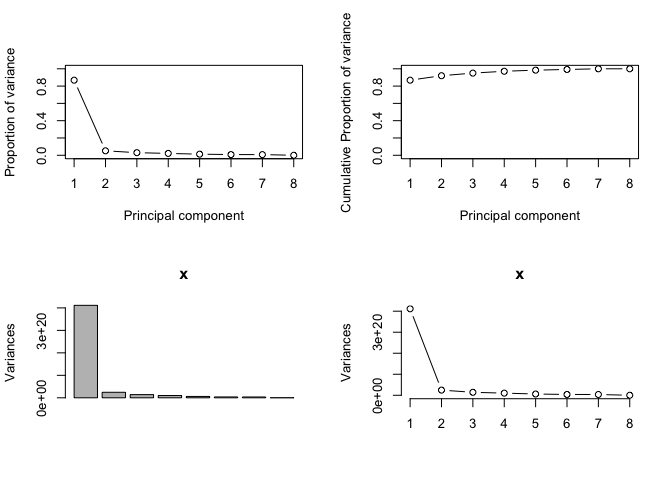
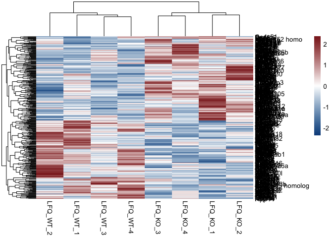
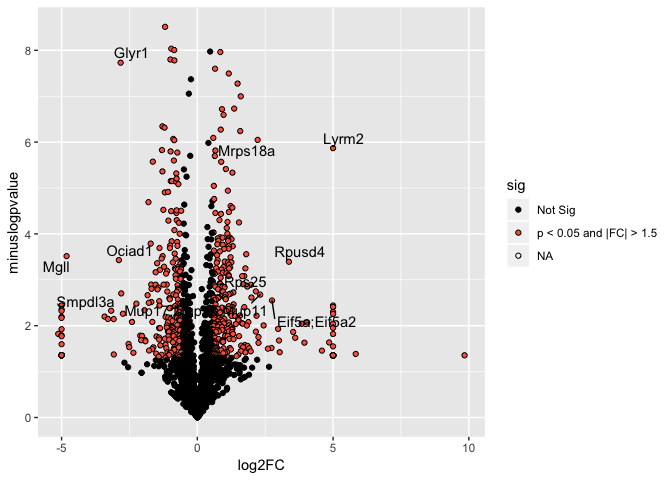

# Proteomics Data Visualization
##Heatmap


```r
library(dplyr)
library(tidyr)
library(pheatmap)
library(openxlsx)
##Pull data for analysis
Liver_raw<-read.xlsx("../1_Input/2_Protein/Liver - PN-0064-1 Liver - mep.xlsx", colNames = T, rowNames = F, sheet = "Cleaned_NoMVs")
Liver_raw$Gene.Symbol<-make.unique(Liver_raw$Gene.Symbol, sep = ".")
Liver_raw.cleaned<-Liver_raw %>% mutate(Gene.Symbol = strsplit(as.character(Gene.Symbol), split = ";")) %>% unnest(Gene.Symbol)
Liver_raw.cleaned$Gene.Symbol<-make.unique(Liver_raw.cleaned$Gene.Symbol, sep = ".")
Liver_raw.complete.cleaned<-Liver_raw.cleaned[!is.na(Liver_raw.cleaned$Gene.Symbol),]
LFQs.Liver_raw<-dplyr::select(Liver_raw.complete.cleaned, contains("LFQ"))
rownames(LFQs.Liver_raw)<-Liver_raw.complete.cleaned$Gene.Symbol
```

## Principal Components Analysis

Once we established that the populations under consideration truly display divergene expression patterns, we sought to determine whether unbiased global gene expression patterns recapitulate the described phenotypes within each Liver failure group. To accomplish this, an unsupervised Principal Components Analysis (PCA) was initially used with normalized counts.

### PCA Features

Before running the principal components analysis, it was necessary to first determine the number of PC's required to account for 80% of the variance, a machine-learning algorithmm benchmark that provides sufficient confidence in the analysis.


```r
#Plot Features of the PCA
library(readxl)
library(dplyr)
library(plotly)
#transpose the dataset (required for PCA)
data.pca<-t(LFQs.Liver_raw)
data.pca<-as.data.frame(data.pca)
##Import the data to be used for annotation
Index<-c(0,0,0,0,1,1,1,1)
Index<-as.data.frame(Index)
##merge the file
data.pca_Final<-cbind(Index, data.pca)
rownames(data.pca_Final)<-data.pca_Final$Row.names
pca.comp<-prcomp(data.pca_Final[,(ncol(Index)+2):ncol(data.pca_Final)])

pcaCharts=function(x) {
    x.var <- x$sdev ^ 2
    x.pvar <- x.var/sum(x.var)
    par(mfrow=c(2,2))
    plot(x.pvar,xlab="Principal component", 
         ylab="Proportion of variance", ylim=c(0,1), type='b')
    plot(cumsum(x.pvar),xlab="Principal component", 
         ylab="Cumulative Proportion of variance", 
         ylim=c(0,1), 
         type='b')
    screeplot(x)
    screeplot(x,type="l")
    par(mfrow=c(1,1))
}
pcaCharts(pca.comp)
```

<!-- -->

```r
png(file=paste0("../2_Output/2_Protein/Proteomics_PCA.Charts.png"))
pcaCharts(pca.comp)
dev.off()
```

```
## quartz_off_screen 
##                 2
```

### 3-Dimensional PCA

From the previous calculations, it is appears that 3 principal components are necessary (accounting for >80% cumulative variance).


```r
##Create a 3D-PCA for Inspection
library(plotly)
##Index
PCs<-cbind(pca.comp$x, Index)
rownames(PCs)<-rownames(data.pca)
ax_text<-list(
  family = "times",
  size = 12,
  color = "black")
t <- list(
  family = "times",
  size = 14,
  color = "black")
pca <- plot_ly(PCs, x = ~PC1, y = ~PC2, z = ~PC3,
   marker = list(color = ~Index, 
                 colorscale = c('#FFE1A1', '#683531'), 
                 showscale = TRUE),
  text=rownames(PCs)) %>%
  add_markers() %>% 
  layout(scene = list(
     xaxis = list(title = 'PC1', zerolinewidth = 4, 
        zerolinecolor="darkgrey", linecolor="darkgrey", 
        linewidth=4, titlefont=t, tickfont=ax_text),
     yaxis = list(title = 'PC2', zerolinewidth = 4, 
        zerolinecolor="darkgrey", linecolor="darkgrey", 
        linewidth=4, titlefont=t, tickfont=ax_text),
    zaxis = list(title = 'PC3', zerolinewidth = 4, 
        zerolinecolor="darkgrey",  linecolor="darkgrey", 
        linewidth=4, titlefont=t, tickfont=ax_text)),
  annotations = list(
           x = 1.13,
           y = 1.03,
           text = 'Diabetes',
           xref = '1',
           yref = '0',
           showarrow = FALSE))
pca #must comment out for PDF generation via knitr (Pandoc)
```

<!--html_preserve--><div id="htmlwidget-d847512e6077f2a281be" style="width:672px;height:480px;" class="plotly html-widget"></div>
<script type="application/json" data-for="htmlwidget-d847512e6077f2a281be">{"x":{"visdat":{"545e6a1e1311":["function () ","plotlyVisDat"]},"cur_data":"545e6a1e1311","attrs":{"545e6a1e1311":{"x":{},"y":{},"z":{},"marker":{"color":{},"colorscale":["#FFE1A1","#683531"],"showscale":true},"text":["LFQ_KO_1","LFQ_KO_2","LFQ_KO_3","LFQ_KO_4","LFQ_WT_1","LFQ_WT_2","LFQ_WT_3","LFQ_WT-4"],"alpha_stroke":1,"sizes":[10,100],"spans":[1,20],"type":"scatter3d","mode":"markers","inherit":true}},"layout":{"margin":{"b":40,"l":60,"t":25,"r":10},"scene":{"xaxis":{"title":"PC1","zerolinewidth":4,"zerolinecolor":"darkgrey","linecolor":"darkgrey","linewidth":4,"titlefont":{"family":"times","size":14,"color":"black"},"tickfont":{"family":"times","size":12,"color":"black"}},"yaxis":{"title":"PC2","zerolinewidth":4,"zerolinecolor":"darkgrey","linecolor":"darkgrey","linewidth":4,"titlefont":{"family":"times","size":14,"color":"black"},"tickfont":{"family":"times","size":12,"color":"black"}},"zaxis":{"title":"PC3","zerolinewidth":4,"zerolinecolor":"darkgrey","linecolor":"darkgrey","linewidth":4,"titlefont":{"family":"times","size":14,"color":"black"},"tickfont":{"family":"times","size":12,"color":"black"}}},"annotations":[{"x":1.13,"y":1.03,"text":"Diabetes","xref":"1","yref":"0","showarrow":false}],"hovermode":"closest","showlegend":false},"source":"A","config":{"modeBarButtonsToAdd":[{"name":"Collaborate","icon":{"width":1000,"ascent":500,"descent":-50,"path":"M487 375c7-10 9-23 5-36l-79-259c-3-12-11-23-22-31-11-8-22-12-35-12l-263 0c-15 0-29 5-43 15-13 10-23 23-28 37-5 13-5 25-1 37 0 0 0 3 1 7 1 5 1 8 1 11 0 2 0 4-1 6 0 3-1 5-1 6 1 2 2 4 3 6 1 2 2 4 4 6 2 3 4 5 5 7 5 7 9 16 13 26 4 10 7 19 9 26 0 2 0 5 0 9-1 4-1 6 0 8 0 2 2 5 4 8 3 3 5 5 5 7 4 6 8 15 12 26 4 11 7 19 7 26 1 1 0 4 0 9-1 4-1 7 0 8 1 2 3 5 6 8 4 4 6 6 6 7 4 5 8 13 13 24 4 11 7 20 7 28 1 1 0 4 0 7-1 3-1 6-1 7 0 2 1 4 3 6 1 1 3 4 5 6 2 3 3 5 5 6 1 2 3 5 4 9 2 3 3 7 5 10 1 3 2 6 4 10 2 4 4 7 6 9 2 3 4 5 7 7 3 2 7 3 11 3 3 0 8 0 13-1l0-1c7 2 12 2 14 2l218 0c14 0 25-5 32-16 8-10 10-23 6-37l-79-259c-7-22-13-37-20-43-7-7-19-10-37-10l-248 0c-5 0-9-2-11-5-2-3-2-7 0-12 4-13 18-20 41-20l264 0c5 0 10 2 16 5 5 3 8 6 10 11l85 282c2 5 2 10 2 17 7-3 13-7 17-13z m-304 0c-1-3-1-5 0-7 1-1 3-2 6-2l174 0c2 0 4 1 7 2 2 2 4 4 5 7l6 18c0 3 0 5-1 7-1 1-3 2-6 2l-173 0c-3 0-5-1-8-2-2-2-4-4-4-7z m-24-73c-1-3-1-5 0-7 2-2 3-2 6-2l174 0c2 0 5 0 7 2 3 2 4 4 5 7l6 18c1 2 0 5-1 6-1 2-3 3-5 3l-174 0c-3 0-5-1-7-3-3-1-4-4-5-6z"},"click":"function(gd) { \n        // is this being viewed in RStudio?\n        if (location.search == '?viewer_pane=1') {\n          alert('To learn about plotly for collaboration, visit:\\n https://cpsievert.github.io/plotly_book/plot-ly-for-collaboration.html');\n        } else {\n          window.open('https://cpsievert.github.io/plotly_book/plot-ly-for-collaboration.html', '_blank');\n        }\n      }"}],"cloud":false},"data":[{"x":[-4161800127.8674,28231458012.5875,5047465188.27373,1808107351.50105,13081262846.2859,-42662305105.9141,4053421827.44794,-5397609992.31476],"y":[-4447810752.32527,7479008900.22409,-7809262689.30121,-2842572828.84711,1761859431.1361,4843521053.24294,420146787.174559,595110098.695951],"z":[3744975042.50554,992399945.641168,-3386543966.90571,708703059.774032,-3814720634.70418,-2348951169.2237,-2621595404.53099,6725733127.44385],"marker":{"color":[0,0,0,0,1,1,1,1],"colorscale":["#FFE1A1","#683531"],"showscale":true,"line":{"color":"rgba(31,119,180,1)"}},"text":["LFQ_KO_1","LFQ_KO_2","LFQ_KO_3","LFQ_KO_4","LFQ_WT_1","LFQ_WT_2","LFQ_WT_3","LFQ_WT-4"],"type":"scatter3d","mode":"markers","error_y":{"color":"rgba(31,119,180,1)"},"error_x":{"color":"rgba(31,119,180,1)"},"line":{"color":"rgba(31,119,180,1)"},"frame":null}],"highlight":{"on":"plotly_click","persistent":false,"dynamic":false,"selectize":false,"opacityDim":0.2,"selected":{"opacity":1},"debounce":0},"base_url":"https://plot.ly"},"evals":["config.modeBarButtonsToAdd.0.click"],"jsHooks":[]}</script><!--/html_preserve-->


```r
library(pheatmap)
library(dplyr)
##Import Data Matrix
Liver_raw_filtered<-dplyr::filter(Liver_raw.complete.cleaned, qval<0.01)
##Filter Differential Methylation Data
HM.proteomics<-data.matrix(select(Liver_raw_filtered, contains("LFQ")))
rownames(HM.proteomics)<-Liver_raw_filtered$Gene.Symbol
HM.proteomics<-HM.proteomics[rowSums(HM.proteomics)>0,]
#Import the Index File
paletteLength <- 100
myColor <- colorRampPalette(c("dodgerblue4", "white", "brown4"))(paletteLength)
heatmap_DMC<-pheatmap(HM.proteomics, color = myColor, scale = "row", clustering_distance_cols = "canberra")
```




##Volcano Plot


```r
##Load Protein Differential Expression

##Volcano Plot 
# Load packages
library(dplyr)
library(ggplot2)
library(ggrepel)

# Read data from the web
results<-read.xlsx("../1_Input/2_Protein/Liver - PN-0064-1 Liver - mep.xlsx", sheet = "IPA_Import")
results = mutate(results, sig=ifelse(results$minuslogpvalue>1.3 & abs(results$log2FC)>0.585, "p < 0.05 and |FC| > 1.5", "Not Sig"))
#plot the ggplot
p = ggplot(results, aes(log2FC, minuslogpvalue)) +
geom_point(aes(fill=sig), colour="black", shape=21) +
scale_fill_manual(values=c("black", "tomato"))
#add a repelling effect to the text labels.
p+geom_text_repel(data=filter(results, minuslogpvalue>2.5 & abs(log2FC)>2), aes(label=Gene))
```

<!-- -->

##Weighted Gene Co-expression Network Analysis (WGCNA)


