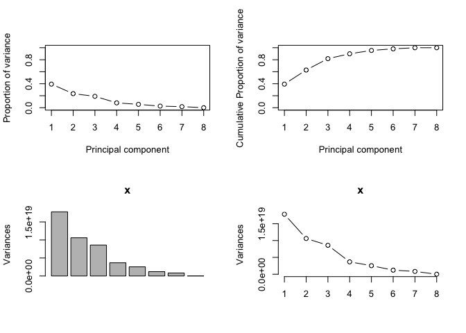
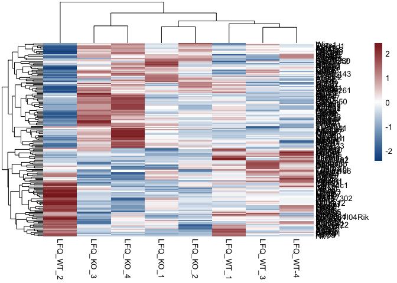
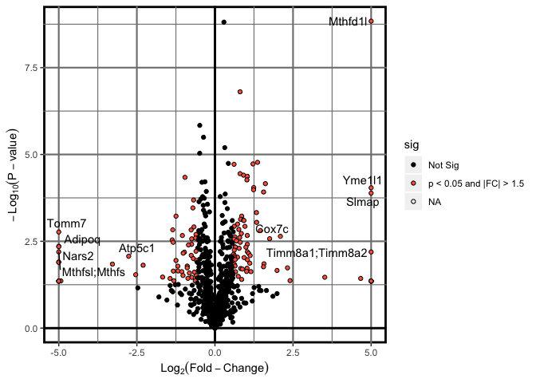
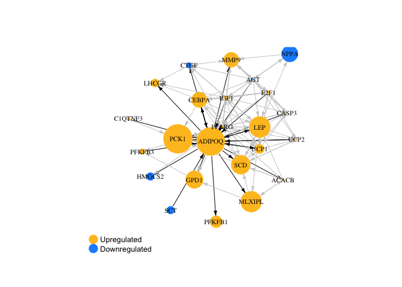
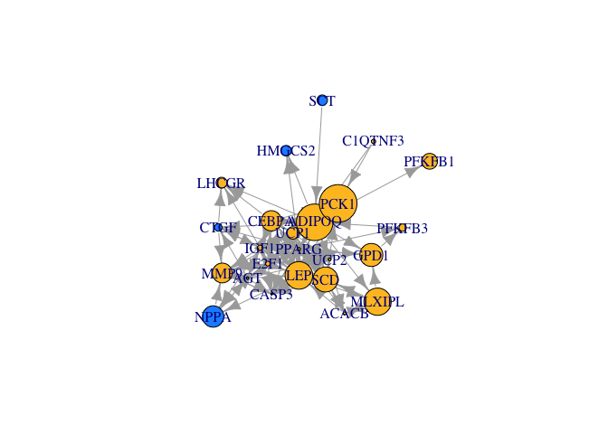

# Proteomics Data Visualization
##Heatmap


```r
library(dplyr)
library(tidyr)
library(pheatmap)
library(openxlsx)
##Pull data for analysis
Heart_raw<-read.xlsx("../1_Input/2_Protein/Heart - PN-0064 Heart - mep.xlsx", colNames = T, rowNames = F, sheet = "Cleaned_NoMVs")
Heart_raw.cleaned<-Heart_raw %>% mutate(Gene.Symbol = strsplit(as.character(Gene.Symbol), split = ";")) %>% unnest(Gene.Symbol)
Heart_raw$Gene.Symbol<-make.unique(Heart_raw$Gene.Symbol, sep = ".")
Heart_raw.complete.cleaned<-Heart_raw.cleaned[!is.na(Heart_raw.cleaned$Gene.Symbol),]
LFQs.Heart_raw<-dplyr::select(Heart_raw.complete.cleaned, contains("LFQ"))
rownames(LFQs.Heart_raw)<-make.unique(Heart_raw.complete.cleaned$Gene.Symbol, sep = ".")
```

## Principal Components Analysis

Once we established that the populations under consideration truly display divergene expression patterns, we sought to determine whether unbiased global gene expression patterns recapitulate the described phenotypes within each heart failure group. To accomplish this, an unsupervised Principal Components Analysis (PCA) was initially used with normalized counts.

### PCA Features

Before running the principal components analysis, it was necessary to first determine the number of PC's required to account for 80% of the variance, a machine-learning algorithmm benchmark that provides sufficient confidence in the analysis.


```r
#Plot Features of the PCA
library(dplyr)
library(plotly)
#transpose the dataset (required for PCA)
data.pca<-t(LFQs.Heart_raw)
data.pca<-as.data.frame(data.pca)
##Import the data to be used for annotation
Index<-c(0,0,0,0,1,1,1,1)
Index<-as.data.frame(Index)
##merge the file
data.pca_Final<-cbind(Index, data.pca)
rownames(data.pca_Final)<-data.pca_Final$Row.names
pca.comp<-prcomp(data.pca_Final[,(ncol(Index)+2):ncol(data.pca_Final)])

pcaCharts=function(x) {
    x.var <- x$sdev ^ 2
    x.pvar <- x.var/sum(x.var)
    par(mfrow=c(2,2))
    plot(x.pvar,xlab="Principal component", 
         ylab="Proportion of variance", ylim=c(0,1), type='b')
    plot(cumsum(x.pvar),xlab="Principal component", 
         ylab="Cumulative Proportion of variance", 
         ylim=c(0,1), 
         type='b')
    screeplot(x)
    screeplot(x,type="l")
    par(mfrow=c(1,1))
}
pcaCharts(pca.comp)
```

<!-- -->

```r
png(file=paste0("../2_Output/2_Protein/Proteomics_PCA.Charts.png"))
pcaCharts(pca.comp)
dev.off()
```

```
## quartz_off_screen 
##                 2
```

### 3-Dimensional PCA

From the previous calculations, it is appears that 3 principal components are necessary (accounting for >80% cumulative variance).


```r
##Create a 3D-PCA for Inspection
library(plotly)
##Index
PCs<-cbind(pca.comp$x, Index)
rownames(PCs)<-rownames(data.pca)
ax_text<-list(
  family = "times",
  size = 12,
  color = "black")
t <- list(
  family = "times",
  size = 14,
  color = "black")
p <- plot_ly(PCs, x = ~PC1, y = ~PC2, z = ~PC3,
   marker = list(color = ~Index, 
                 colorscale = c('#FFE1A1', '#683531'), 
                 showscale = TRUE),
  text=rownames(PCs)) %>%
  add_markers() %>% 
  layout(scene = list(
     xaxis = list(title = 'PC1', zerolinewidth = 4, 
        zerolinecolor="darkgrey", linecolor="darkgrey", 
        linewidth=4, titlefont=t, tickfont=ax_text),
     yaxis = list(title = 'PC2', zerolinewidth = 4, 
        zerolinecolor="darkgrey", linecolor="darkgrey", 
        linewidth=4, titlefont=t, tickfont=ax_text),
    zaxis = list(title = 'PC3', zerolinewidth = 4, 
        zerolinecolor="darkgrey",  linecolor="darkgrey", 
        linewidth=4, titlefont=t, tickfont=ax_text)),
  annotations = list(
           x = 1.13,
           y = 1.03,
           text = 'Diabetes',
           xref = '1',
           yref = '0',
           showarrow = FALSE))
p #must comment out for PDF generation via knitr (Pandoc)
```

<!--html_preserve--><div id="htmlwidget-7e65eb51afd872ee1e12" style="width:672px;height:480px;" class="plotly html-widget"></div>
<script type="application/json" data-for="htmlwidget-7e65eb51afd872ee1e12">{"x":{"visdat":{"7cc1762df412":["function () ","plotlyVisDat"]},"cur_data":"7cc1762df412","attrs":{"7cc1762df412":{"x":{},"y":{},"z":{},"marker":{"color":{},"colorscale":["#FFE1A1","#683531"],"showscale":true},"text":["LFQ_KO_1","LFQ_KO_2","LFQ_KO_3","LFQ_KO_4","LFQ_WT_1","LFQ_WT_2","LFQ_WT_3","LFQ_WT-4"],"alpha_stroke":1,"sizes":[10,100],"spans":[1,20],"type":"scatter3d","mode":"markers","inherit":true}},"layout":{"margin":{"b":40,"l":60,"t":25,"r":10},"scene":{"xaxis":{"title":"PC1","zerolinewidth":4,"zerolinecolor":"darkgrey","linecolor":"darkgrey","linewidth":4,"titlefont":{"family":"times","size":14,"color":"black"},"tickfont":{"family":"times","size":12,"color":"black"}},"yaxis":{"title":"PC2","zerolinewidth":4,"zerolinecolor":"darkgrey","linecolor":"darkgrey","linewidth":4,"titlefont":{"family":"times","size":14,"color":"black"},"tickfont":{"family":"times","size":12,"color":"black"}},"zaxis":{"title":"PC3","zerolinewidth":4,"zerolinecolor":"darkgrey","linecolor":"darkgrey","linewidth":4,"titlefont":{"family":"times","size":14,"color":"black"},"tickfont":{"family":"times","size":12,"color":"black"}}},"annotations":[{"x":1.13,"y":1.03,"text":"Diabetes","xref":"1","yref":"0","showarrow":false}],"hovermode":"closest","showlegend":false},"source":"A","config":{"modeBarButtonsToAdd":[{"name":"Collaborate","icon":{"width":1000,"ascent":500,"descent":-50,"path":"M487 375c7-10 9-23 5-36l-79-259c-3-12-11-23-22-31-11-8-22-12-35-12l-263 0c-15 0-29 5-43 15-13 10-23 23-28 37-5 13-5 25-1 37 0 0 0 3 1 7 1 5 1 8 1 11 0 2 0 4-1 6 0 3-1 5-1 6 1 2 2 4 3 6 1 2 2 4 4 6 2 3 4 5 5 7 5 7 9 16 13 26 4 10 7 19 9 26 0 2 0 5 0 9-1 4-1 6 0 8 0 2 2 5 4 8 3 3 5 5 5 7 4 6 8 15 12 26 4 11 7 19 7 26 1 1 0 4 0 9-1 4-1 7 0 8 1 2 3 5 6 8 4 4 6 6 6 7 4 5 8 13 13 24 4 11 7 20 7 28 1 1 0 4 0 7-1 3-1 6-1 7 0 2 1 4 3 6 1 1 3 4 5 6 2 3 3 5 5 6 1 2 3 5 4 9 2 3 3 7 5 10 1 3 2 6 4 10 2 4 4 7 6 9 2 3 4 5 7 7 3 2 7 3 11 3 3 0 8 0 13-1l0-1c7 2 12 2 14 2l218 0c14 0 25-5 32-16 8-10 10-23 6-37l-79-259c-7-22-13-37-20-43-7-7-19-10-37-10l-248 0c-5 0-9-2-11-5-2-3-2-7 0-12 4-13 18-20 41-20l264 0c5 0 10 2 16 5 5 3 8 6 10 11l85 282c2 5 2 10 2 17 7-3 13-7 17-13z m-304 0c-1-3-1-5 0-7 1-1 3-2 6-2l174 0c2 0 4 1 7 2 2 2 4 4 5 7l6 18c0 3 0 5-1 7-1 1-3 2-6 2l-173 0c-3 0-5-1-8-2-2-2-4-4-4-7z m-24-73c-1-3-1-5 0-7 2-2 3-2 6-2l174 0c2 0 5 0 7 2 3 2 4 4 5 7l6 18c1 2 0 5-1 6-1 2-3 3-5 3l-174 0c-3 0-5-1-7-3-3-1-4-4-5-6z"},"click":"function(gd) { \n        // is this being viewed in RStudio?\n        if (location.search == '?viewer_pane=1') {\n          alert('To learn about plotly for collaboration, visit:\\n https://cpsievert.github.io/plotly_book/plot-ly-for-collaboration.html');\n        } else {\n          window.open('https://cpsievert.github.io/plotly_book/plot-ly-for-collaboration.html', '_blank');\n        }\n      }"}],"cloud":false},"data":[{"x":[-2918576935.90386,2459685560.459,-1373228203.84966,-4384935680.9752,-2782814640.60711,8782857204.63625,-1329142806.06741,1546155502.30801],"y":[-2229783552.5757,-1313517517.36625,6688086733.88126,924803394.464327,822877878.794717,1210636540.40344,-3845143196.31129,-2257960281.2905],"z":[2318990539.07658,1883372339.33188,3514699646.77686,-4756014314.36773,-2624597275.7748,-2565822271.70391,733195398.188142,1496175938.47299],"marker":{"color":[0,0,0,0,1,1,1,1],"colorscale":["#FFE1A1","#683531"],"showscale":true,"line":{"color":"rgba(31,119,180,1)"}},"text":["LFQ_KO_1","LFQ_KO_2","LFQ_KO_3","LFQ_KO_4","LFQ_WT_1","LFQ_WT_2","LFQ_WT_3","LFQ_WT-4"],"type":"scatter3d","mode":"markers","error_y":{"color":"rgba(31,119,180,1)"},"error_x":{"color":"rgba(31,119,180,1)"},"line":{"color":"rgba(31,119,180,1)"},"frame":null}],"highlight":{"on":"plotly_click","persistent":false,"dynamic":false,"selectize":false,"opacityDim":0.2,"selected":{"opacity":1},"debounce":0},"base_url":"https://plot.ly"},"evals":["config.modeBarButtonsToAdd.0.click"],"jsHooks":[]}</script><!--/html_preserve-->


```r
library(pheatmap)
library(dplyr)
##Import Data Matrix
Results_HM<-dplyr::filter(Heart_raw.complete.cleaned, minuslog_pval>2)
HM_data.p05<-data.matrix(dplyr::select(Results_HM, contains("LFQ")))
rownames(HM_data.p05)<-Results_HM$Gene.Symbol
#Import the Index File
paletteLength <- 100
myColor <- colorRampPalette(c("dodgerblue4", "white", "brown4"))(paletteLength)
pheatmap(HM_data.p05, color = myColor, scale = "row")
```



```r
pheatmap(HM_data.p05, color = myColor, scale = "row", filename = "../2_Output/2_Protein/Heatmap.Heart_LFQs.p01.pdf")
```

##Volcano Plot


```r
# Load packages
library(dplyr)
library(ggplot2)
library(ggrepel)
library(openxlsx)
# Read data from the web
results<-read.xlsx("../1_Input/2_Protein/Heart - PN-0064 Heart - mep.xlsx", sheet = "IPA_Import")
results = mutate(results, sig=ifelse(results$minuslogpvalue>1.3 & abs(results$log2FC)>0.585, "p < 0.05 and |FC| > 1.5", "Not Sig"))
#plot the ggplot
p = ggplot(results, aes(log2FC, minuslogpvalue)) + theme(panel.background = element_rect("white", colour = "black", size=2), panel.grid.major = element_line(colour = "gray50", size=.75), panel.grid.minor = element_line(colour = "gray50", size=0.4)) + 
geom_point(aes(fill=sig), colour="black", shape=21) + labs(x=expression(Log[2](Fold-Change)), y=expression(-Log[10](P-value))) + xlim(-5,5)+ geom_hline(yintercept = 0, size = 1) + geom_vline(xintercept=0, size=1)+ 
scale_fill_manual(values=c("black", "tomato"))
#add a repelling effect to the text labels.
p+geom_text_repel(data=filter(results, minuslogpvalue>2 & abs(log2FC)>2), aes(label=Gene))
```

<!-- -->

```r
pdf(file = "../2_Output/2_Protein/Volcano.Plot_Heart.pdf")
p+geom_text_repel(data=filter(results, minuslogpvalue>2 & abs(log2FC)>1), aes(label=Gene))
dev.off()
```

```
## quartz_off_screen 
##                 2
```

#Network Analysis

##Load the network data


```r
# Load the packages used for the network analysis
library("igraph")
library("network")
library("sna")
library("ndtv")
library("openxlsx")
library(tidyr)
library(dplyr)
# Load the data used for the network analysis
links <- read.xlsx("../1_Input/Pathways/Adiponectin_Network_AA.ONLY_ICM.v.NICM.xlsx")
links<- links %>% mutate(From = strsplit(as.character(From), split = ";")) %>% unnest(From)
links<- links %>% mutate(To = strsplit(as.character(To), split = ";")) %>% unnest(To)
links<-unique(links[,2:3])
nodes <- read.xlsx("../1_Input/1_RNA/LRT-Ischemia-Race Interaction_DESeq2.xlsx", sheet = "Unfiltered")
nodes<-dplyr::mutate(nodes, Logpvalue=-log(pvalue, 10))
nodes<-dplyr::select(nodes, -pvalue)
nodes<-nodes %>% mutate(Gene = strsplit(as.character(external_gene_name), split = ";")) %>% unnest(Gene)
nodes$Gene<-make.unique(nodes$Gene, sep = ".")
nodes<-nodes[!is.na(nodes$Gene),]
nodes<-dplyr::select(nodes, id=Gene, log2FoldChange, Logpvalue)
nodes_To<-merge(nodes, links, by.x = "id", by.y = "To")
nodes_To<-dplyr::select(nodes_To, -"From")
nodes_From<-merge(nodes, links, by.x = "id", by.y = "From")
nodes_From<-dplyr::select(nodes_From, -To)
nodes_both<-rbind(nodes_To, nodes_From)
nodes_filtered<-distinct(nodes_both)
#create colors for nodes based on fold-change
nodes_filtered = mutate(nodes_filtered, colrs=ifelse(nodes_filtered$log2FoldChange>0, "goldenrod1", "dodgerblue"))
# Examine the data
head(nodes)
```

```
##         id log2FoldChange  Logpvalue
## 1   TSPAN6   -0.174198936 0.89967284
## 2     TNMD    1.367731837 4.09888460
## 3     DPM1   -0.072854878 0.03328028
## 4    SCYL3    0.148501007 0.48531617
## 5 C1orf112    0.008380419 0.35216380
## 6      FGR    1.141066575 1.43322194
```

```r
head(links)
```

```
##     From     To
## 1  ACACB  ACACB
## 2  ACACB    LEP
## 3  ACACB MLXIPL
## 4  ACACB  PPARG
## 5  ACACB    SCD
## 6 ADIPOQ  CASP3
```

```r
# since there are a few repeated links, we can consolidate them
links<-links[order(links$From, links$To),]
rownames(links)<-NULL
```


## Setup the igraph object


```r
library("igraph")
net<-graph.data.frame(links, nodes_filtered, directed=T)
net
```

```
## IGRAPH 18eb837 DN-- 24 134 -- 
## + attr: name (v/c), log2FoldChange (v/n), Logpvalue (v/n), colrs
## | (v/c)
## + edges from 18eb837 (vertex names):
##  [1] ACACB ->ACACB  ACACB ->LEP    ACACB ->MLXIPL ACACB ->PPARG 
##  [5] ACACB ->SCD    ADIPOQ->ACACB  ADIPOQ->ADIPOQ ADIPOQ->CASP3 
##  [9] ADIPOQ->CEBPA  ADIPOQ->CTGF   ADIPOQ->GPD1   ADIPOQ->HMGCS2
## [13] ADIPOQ->LEP    ADIPOQ->LHCGR  ADIPOQ->MLXIPL ADIPOQ->MMP9  
## [17] ADIPOQ->PCK1   ADIPOQ->PFKFB1 ADIPOQ->PPARG  ADIPOQ->SCD   
## [21] ADIPOQ->UCP1   ADIPOQ->UCP2   AGT   ->ADIPOQ AGT   ->AGT   
## [25] AGT   ->CASP3  AGT   ->CTGF   AGT   ->IGF1   AGT   ->LEP   
## + ... omitted several edges
```

## plot the network


```r
net<-simplify(net, remove.multiple = F, remove.loops = T)
V(net)$color<-nodes_filtered$colrs #change the node colors based on the fold-change (red = up)
V(net)$size<-abs(V(net)$log2FoldChange)*5
#Create a layout format
l <- layout_with_kk(net)
l <- norm_coords(l, ymin=-1, ymax=1, xmin=-1, xmax=1)
#Highlight the ADIPOQ Targets
inc.edges <- incident(net,  V(net)[[2]], mode="all")
ecol <- rep("gray80", ecount(net))
ecol[inc.edges] <- "black"
#plot the network
plot(net, edge.arrow.size=0.4, label.cex=2, vertex.label.color="black", vertex.label.cex=.7, vertex.frame.color=NA, layout = l, rescale=F, edge.color=ecol)
legend(x=-1.5, y=-1.1, c("Upregulated", "Downregulated"), pch=21, col=c("goldenrod1", "dodgerblue"), pt.bg = c("goldenrod1", "dodgerblue"), pt.cex=2, cex = 0.8, bty = "n", ncol = 1)
```

<!-- -->

```r
##Create a pdf file of the network
pdf(file="../2_Output/1_RNA/ADIPOQ_Gene.Network.pdf")
plot(net, edge.arrow.size=0.4, label.cex=2, vertex.label.color="black", vertex.label.cex=.7, edge.color="gray50", vertex.frame.color=NA, layout = l, rescale=F, , edge.color = ecol)
legend(x=-1.5, y=-1.1, c("Upregulated", "Downregulated"), pch=21, col=c("goldenrod1", "dodgerblue"), pt.bg = c("goldenrod1", "dodgerblue"), pt.cex=2, cex = 0.8, bty = "n", ncol = 1)
dev.off()
```

```
## quartz_off_screen 
##                 2
```

##Weighted Gene Co-expression Network Analysis (WGCNA)


```r
tkid <- tkplot(net) #tkid is the id of the tkplot that will open
l <- tkplot.getcoords(tkid) # grab the coordinates from tkplot
plot(net, layout=l)
```

<!-- -->


